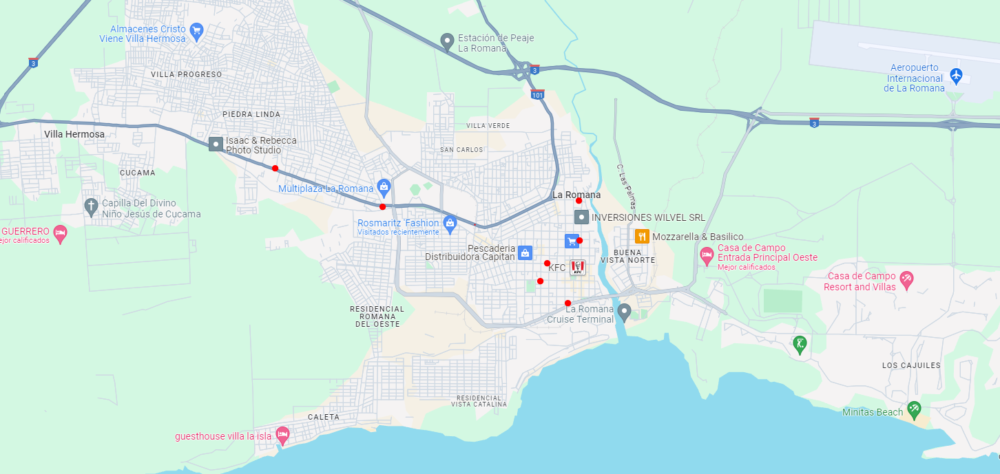

# Proyecto NestJS

Este proyecto utiliza NestJS como framework de backend y PostgreSQL como base de datos. A continuación, se describen los pasos para configurar y ejecutar el proyecto.

## Requisitos

- [Docker](https://www.docker.com/get-started) instalado en tu sistema
- [Node.js](https://nodejs.org/) y [Yarn](https://yarnpkg.com/) instalados

## Configuración de la Base de Datos con Docker

Sigue estos pasos para configurar la base de datos PostgreSQL usando Docker.

### Descargar y ejecutar PostgreSQL

Ejecuta el siguiente comando para descargar la imagen de PostgreSQL y ejecutar un contenedor:

```bash

docker pull postgres

docker run --name docker-SqlPostgres 
  -e POSTGRES_USER=localhost 
  -e POSTGRES_PASSWORD=localhost123 
  -e POSTGRES_DB=dbtaxi24 
  -p 5432:5432 
  -d postgres
## Description

[Nest](https://github.com/nestjs/nest) framework TypeScript starter repository.

## Installation

```bash
$ yarn install

## General la base de datos en el proyecto

$ yarn migrate 

## Insertar datos de ejemplo que se encuentra en la carpeta prisma archivo seed.ts

$ yarn seed 

## luego ejecutar el proyecto 

$ yarn run start:dev
```


## Support

Nest is an MIT-licensed open source project. It can grow thanks to the sponsors and support by the amazing backers. If you'd like to join them, please [read more here](https://docs.nestjs.com/support).

## Stay in touch

- Linkedin - [Gregory Sanchez](https://www.linkedin.com/in/gregory-albert-s%C3%A1nchez-05820019b/)
- GitHub - [gregoryput](https://github.com/gregoryput)

## License

Nest is [MIT licensed](LICENSE).


## Uso de los Endpoints Creados

Para facilitar el análisis del proyecto y el uso de los diferentes endpoints creados, se han proporcionado ejemplos en formato JSON. Estos ejemplos ilustran cómo interactuar con la API y permiten una comprensión más clara de las funcionalidades disponibles. En este caso práctico, todos los conductores están ubicados en la provincia de La Romana, lo que permite centrarse en un escenario geográfico específico para evaluar la eficacia de los endpoints.

#  Escenario de Ejemplo 

IMAGEN para mayor compresion: 



**Nota:** En el archivo seed.ts están los modelos con la ubicación exacta y un comentario de dónde se encuentra cada uno. Este es solo una guía de ejemplo para tener mayor contexto del proyecto.

**URL drivers** 

Todos los conductores 
```bash
http://localhost:3000/drivers
```
Buscar  conductores por id
```bash
http://localhost:3000/drivers/id
```

Todos los conductores que estan disponible 
```bash
http://localhost:3000/drivers/status
```
Todos los conductores que estan cerca en un radio de 3km de distancia  para una ubicacion especifica 
```bash
http://localhost:3000/drivers/localization?longitude=18.431912088138972&latitude=-68.97259722473999
```


**URL passengers** 

 Todos los pasajeros 
```bash
http://localhost:3000/passengers
```

Buscar los pasajeros por id
```bash
http://localhost:3000/passengers/id
```
Los 3 conductores disponible mas cerca del pasajero que esta solicitando un viaje
```bash
http://localhost:3000/passengers/localization?longitude=18.431912088138972&latitude=-68.97259722473999
```


**URL trips** 

 Todos los viajes que esta en progreso o activos 
```bash
http://localhost:3000/trip
```

Completar un viaje que esta en progreso
```bash
## verbo PATCH // Nota: ya que solo cambia un estado y no es una actualizacion completa 
http://localhost:3000/trip

##JSON de prueba
{
  "trip_id":1,
  "status":"completed"
}


```

Crear un viaje 
```bash
## verbo POST  
http://localhost:3000/trip

## JSON de prueba

{
  "passenger_id": 3,
  "driver_id": 3,
  "start_time": "2024-08-10T10:00:00Z",
  "end_time": "2024-08-10T10:30:00Z",
  "status": "in_progress",
  "start_location": {
    "type": "Point",
    "coordinates": [-73.98513, 40.758]
  },
  "end_location": {
    "type": "Point",
    "coordinates": [-73.935242, 40.73061]
  },
  "total_distance": 5.0
}

```


